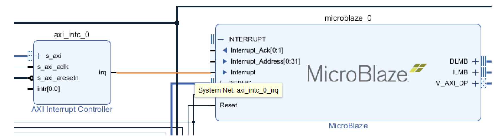
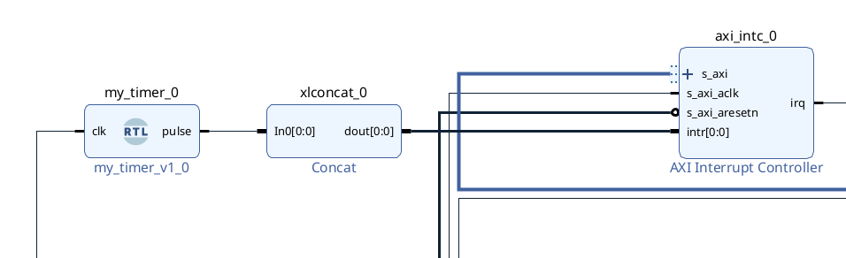

# Project 2: Baby's First SoC

## Overview
In this lab, you will learn how to put a processor onto your FPGA. You will then use this microprocessor to control some hardware that is on the FPGA, as well as learn how to handle some I/O components fully in software. This will definitely refresh your mind about microprocessors! Ideally, this will prepare you with some extra skills to use for your final project.

## Resources
Refer to the User Manual below for pin connections and peripherals you can use:
https://www.realdigital.org/doc/496fed57c6b275735fe24c85de5718c2

# Instructions

## Task 1: Setting up the Microblaze

Make sure to select the `xc7s50csga324-1` as the FPGA part to target.

Please watch the following video for all setup instructions.
https://youtu.be/x__NwUMkB80?si=GMS5lMFyEwcl28UG

You will follow the entire tutorial and take a picture of your PuTTY terminal showing the text:
```
Starting Application
My name is <YOUR NAME>
```
along with the board having the LEDs mapped to the switches.

The starter code that is used in the video is located in `sw/example.c`. Make sure that you are able to get the basic LED application to work.

One thing I forgot to mention in the video is that writing to the AXI peripherals and APB peripherals are exactly the same. There is no difference in how you access them from the software perspective (as was shown with the switches being AXI and the LEDs being APB).
Note that the RGBs are also accessible via software, but they are are at an offset from the rest of the LEDs.
You can imagine that this APB component has 3 registers:

| Reg1 | Reg2 | Reg3 |
|------|-------|------|
| LEDS | RGB0 | RGB1 |
| 32 bits | 32 bits | 32 bits |
| [31:16] unused | [31:3] unused | [31:3] unused |
| BASEADDR | BASEADDR + 4*1 | BASEADDR + 4*2|

So, to write to RGB1, for example, you would write to LEDS Base address + 4*2 
You can add a #define at the top of your file like: 

`#define RGB1_ADDR LEDS_ADDR+4*2`

Then, you could write to the bottom 3 bits of that address (can send to the whole register but only bottom 3 are used).

### Deliverables
`images/part1.{jpg/png}` - picture of your board and PuTTY terminal showing your name and the LEDs
- `sw/part1.c` - all code written for part 1  

## Task 2: Using Interrupts 
In your hardware design, add an `AXI Interrupt Controller`. Customize the component and set the interrupt type to an Edge Interrupt, and the Interrupt Output Connection to 'Single'. Run connection automation, and then manually connect the controller's output interrupt line to the interrupt port of the Microblaze.


Add a component called `Concat`. Attach the `dout` signal to the `intr[0:0]` signal of the AXI interrupt controller. 

Add the RTL from the `hdl/my_timer.vhd` file to the schematic (right click > add module to block design once you have added it as a source). Attach its clock source to the same clock as the rest of the components, and attach the `pulse` signal to one of the Concat inputs. You can reduce the number of ports on the Concat component to 1 for now, since we will only use 1 interrupt source. It should look something like this:



Re-export your hardware XSA file, change the hardware specification on Vitis, and rebuild the platform. Use the code in `sw/example_part2.c` as a starting point.

### Tasks:
1. In the ISR, write some code that modifies the color value of the RGBs randomly. You should make them have different values (note, without any type of PWM, we can only get 8 different colors). 
2. Instead of directly mapping the switches to their corresponding LEDs, treat the switches as a binary number and map it to some arbitrary LED pattern. Do this for at least 6 cases (there are 2^16 possible cases...). Some pseudocode is provided below to detail what this means.
```cpp
// Example: 
static u16 leds = 0;
u32 switches = Xil_In32(SWITCHES_ADDR) & 0xFFFF;

switch (switches) {
    case 0: leds = ~switches ; break; // direct inverted mirror
    case 1: leds = 0xABCD; break; // random
    case 2: leds = 0xAAAA; break; // alternating pattern
    // ... etc
}
```

### Deliverables
- `images/part2.{jpg/png}` - screenshot of terminal showing that ISR was fired. 
- include a short clip somewhere in your report as a link (edit the video and combine it with your part 3 demo showcasing the functionality)
- `sw/part2.c` - all code written for part 2                  


## Task 3: Controlling the Board with UART
Note: if you are a graduate student, please see and complete task 4 before you do this.

You will use the terminal to send the Urbana commands via PuTTY. Based on the command, your application will need to do the following:
- r	- > Set RGB0 to red
- g	- > Set RGB0 to green
- b	- > Set RGB0 to blue
- 1	- > Select LED pattern 1 (mirror the switches)
- 2	- > Select LED pattern 2 (random pattern)
- p	- > Increase RGB animation speed
- m - > Decrease RGB animation speed

In addition, you will need to use a **SOFTWARE** implementation to achieve a PWM effect for the RGBs to get more colors. You can use a small resolution (3 or 4-bit PWM) to make the code go faster. This means you don't need any ISR or even to interface with the timer component for this part.

The pseudocode below details the overall goals:
```cpp
xil_printf("Starting interactive LED & RGB lab\r\n");

    while (1) {
        // 1. Poll switches for LED pattern
        UpdateLEDs();

        // 2. Poll UART for commands
        HandleUART();

        // 3. Update RGBs via software PWM. You do not need to use the hardware 
        UpdateRGBS();
    }
```

```cpp
loop forever:

    // --- 1. Poll switches ---
    switches = read_switches()
    led_pattern = switches
    
    // --- 2. Poll UART for input ---
    if UART has new character:
        c = read_UART_character()
        switch c:
            'r' → rgb0_value = red
            'g' → rgb0_value = green
            'b' → rgb0_value = blue
            'R' → rgb1_value = red
            'G' → rgb1_value = green
            'B' → rgb1_value = blue
            '1' → led_pattern = 1
            '2' → led_pattern = 2
            '+' → increase PWM speed (decrease delay) -- essentially, raise brightness
            '-' → decrease PWM speed (increase delay) -- essentially, darken
            default → ignore

    // --- 3. Update LED pattern ---
    switch led_pattern:
        0 → turn all LEDs off
        1 → random pattern
        2 → alternating pattern - 0xAAAA
        default → all LEDs off
    write_LED_output(leds)

    // --- 4. Increment PWM counter ---
    pwm_counter = (pwm_counter + 1) & 0x7   // 3-bit PWM cycle

    // --- 5. Update RGB outputs using software PWM ---
    for each RGB (rgb0_value, rgb1_value):
        for each channel R, G, B:
            if channel_value > pwm_counter:
                output channel HIGH
            else:
                output channel LOW

    // --- 6. Update RGB color automatically every 1 second ---
    color_tick++;
    if (color_tick >= 5) { // update color X times per second
        color_tick = 0;
        rgb0_value = (rgb0_value + 1) & 0x7; 
    }

end loop
```

You can implement this however you want. Do some research on PWM if you need to brush up on it. You will demonstrate all the functionality in your video and report. An example of how to read data from the UART module is in `src/example_uart.c`, and it is up to you to expand it as you see fit. Note that you should probably just copy what you had for the previous part to `src/part3.c` and add/remove the relevant portions.

### Deliverables
- include a short clip somewhere in your report as a link (edit the video and combine it with your part 2 demo showcasing the functionality)
- `sw/part3.c` - all code written for part 3

## Task 4 (Graduate Sections Only):
Inspecting the code that was used for the LED APB component, you must now create your own APB component for the 16 switches, create your own IP for this, and showcase Task 3 working with your custom component.
Refer to: https://www.realdigital.org/doc/78e6f9b1a03ba4ca131ff3ba2e4dff3f

### Deliverables
- `hdl/apb_switch_ctl.{vhd, v, sv}`
- `hdl/switch_ctl.{vhd, v, sv}`

 
# Submission
1. Include all screenshots in the `images` folder and in your report.
2. Include all source files in the `sw` or `hdl` folders, depending on what is specified above.
3. Record a video of your designs working (part 2 and 3). Make sure to show your Vivado block diagram in the recording. Stitch the two recordings together from each part so it is a single video.
4. **(Grad only)** Show that you used an APB Switch module for part 3.
5. Write a short report using the [template provided in this repository](REPORT_TEMPLATE.docx) outlining what you learned in this assignment. 

